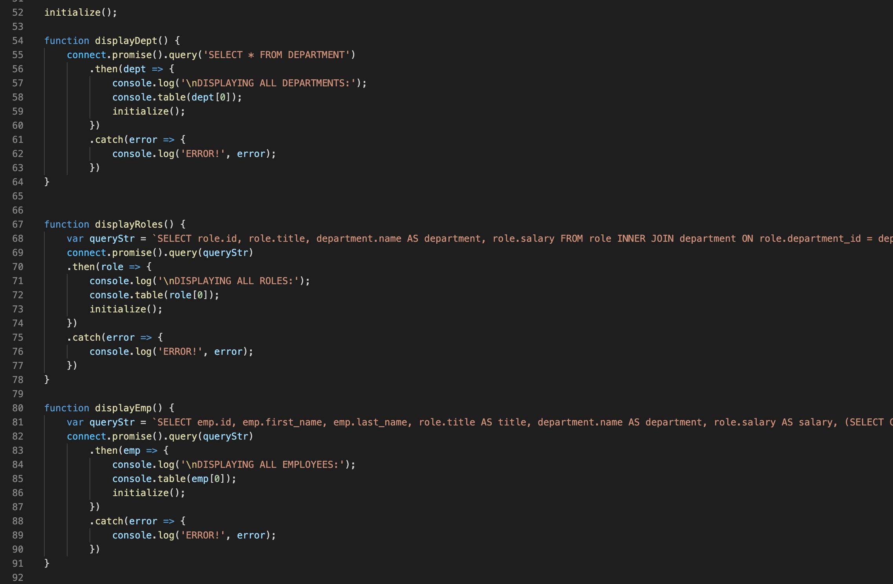

# Tracking Your Employees

[](https://opensource.org/licenses/MIT)

## Short Description

This node-based application allows managers and company planners to view, edit, and manage aspects of their company information - such as the employment directory, jobs positions offered by thee company, and more. 

## Before You Begin - Installation Instructions

Below are the command line steps to install the repository and its packages onto your system.

```
git clone https://github.com/pbyakod/tracking-employees.git
npm install
```

Once complete, enter your mySQL password on line 12 of the index.js file, and then code the following under ./databases

```
mysql -u root -p
source schema.sql
source seeds.sql
```

Move back to bash, and cd into ./databases again, where you'll run

```
npm start
```
to begin the program. Enjoy!

## Raw Code Image

</img>

## Walkthrough Video Link

<a href="https://drive.google.com/file/d/17SxwG5DOzD7nHcJwAQgv8AifFS-3JR-S/view?usp=sharing">Click Me!</a>